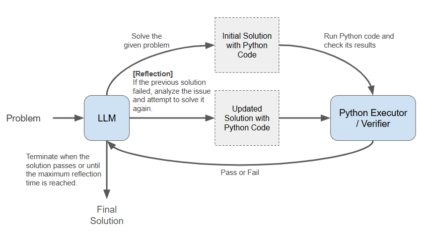

# 🌟 AI Code Hacker 🚀

This repository showcases an implementation of an AI-powered code hacker 🤖 designed to solve problems from the [Meta Hacker Cup 2024](https://www.facebook.com/codingcompetitions/hacker-cup) 🏆. With advanced Large Language Models (LLMs) like Google's Gemini or OpenAI's GPT-4o, this project highlights the cutting-edge capabilities of AI in competitive programming and algorithmic problem-solving. 💡💻

## 🔎 Overview
The following flowchart illustrates the problem-solving pipeline:



## 🚀 Getting Started  

### 1. Install Dependencies  
Ensure you have Python installed, and then run:
```bash  
pip install -r requirements.txt  
```  

### 2. Prepare the Data  
Download and extract the problem dataset as follows:  
1.Get the [Meta Hacker Cup 2024 Round 2 Data](https://drive.google.com/file/d/1buaEbjurH_7DnEohKHBA1UggoYSJtUj0/view?usp=drive_link).  
2.Extract the data into your preferred directory:  
   ```bash  
   mkdir path_to_save_data  
   tar xvf contestData_2024_r2.tar -C path_to_save_data  
   ```  

## 🔧 Running the Solution  

### Step 1: Set Up Your API Key  
Set your API key for Gemini using the GOOGLE_API_KEY environment variable:  
```bash  
export GOOGLE_API_KEY=your_api_key  
```  

### Step 2: Choose a Mode of Operation  

#### AutoGen Mode  
Uses the AutoGen framework to generate a solution based on problem input.
```bash  
python run_autogen.py \
    <problem_id> \
    <problem_name> \
    <data_path>  
```  

#### LangChain Mode  
Uses the LangChain framework to generate a solution to the problem input.
```bash  
python run_langchain.py \
    <problem_id> \
    <problem_name> \
    <data_path>  
```  

#### Argument Description  
- **`problem_id`**: A unique identifier for the problem.  
- **`problem_name`**: The name of the problem (typically the directory name).  
- **`data_path`**: The directory where the problem dataset is stored.

### Result
After execution, Python code that solves the given problem will be generated in the data_path/problem_name directory.

## 📊 Benchmarking  
Performance evaluation and benchmarking tools are under development and will be released in future updates. 
